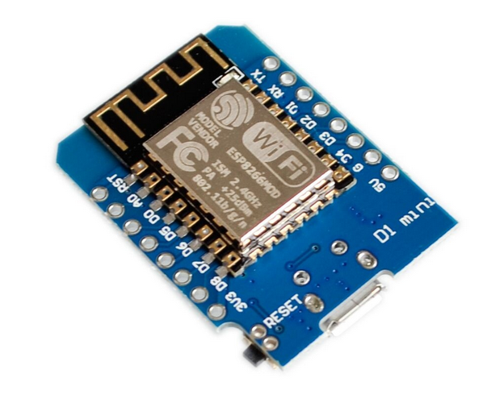
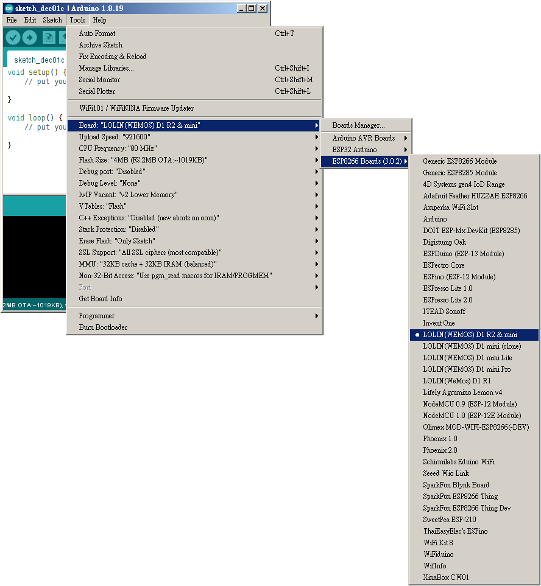
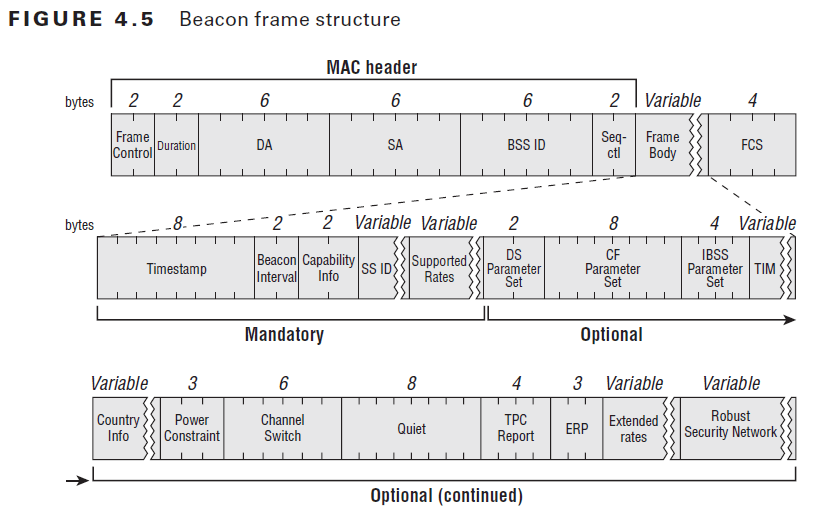
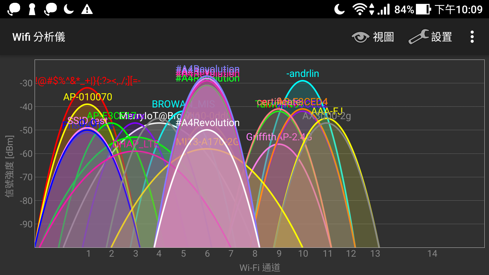

# WIFI SEND FREEDOM -- #A4Revolution


## 故事起源

[&#x23;白紙革命](https://zh.wikipedia.org/wiki/%E5%8F%8D%E5%B0%8D%E5%8B%95%E6%85%8B%E6%B8%85%E9%9B%B6%E6%94%BF%E7%AD%96%E9%81%8B%E5%8B%95)後，看到有人在臉書上分享：[基于esp8266的wifi ssid广播通信](https://libreddit.nl/r/China_irl/comments/ygcbd3/%E5%9F%BA%E4%BA%8Eesp8266%E7%9A%84wifi_ssid%E5%B9%BF%E6%92%AD%E9%80%9A%E4%BF%A1/?fbclid=IwAR0ld_9tIWD1t9u8N5ZNgUm1TVDx1rufM6YWUer28nC6nlY5vjOlEO4fzG4)

簡單來說，這位網友利用一片小型的 WiFi 開發板，建置了一個 WiFi Hotspot，透過不斷地同時廣播多個 SSID 名稱來表達訴求。

原理其實就跟你使用手機分享熱點是一樣的，只是你的手機開啟熱點後，通常只能廣播出一個 SSID 名稱，技術上也可以透過 MAC 地址溯源是哪個手機發出來的（一般來說，網路裝置的 MAC 地址資訊是設備生產時就燒寫在硬體的）。而這個 WiFi SSID 廣播裝置則會同時發送多個 SSID 名稱，並且透過隨機產生 MAC 地址的方式隱蔽發送者的資訊。

從貼文下方的幾則討論中，可以抓幾個技術上的重點:

* MAC 是隨機產生的，封包使用低階的 API 函式發送
* 可使用行動電源供電，在集會場所上電
* SSID 有 32 bytes 的限制，如果要顯示中文就會更有限制
* 透過 RSSI 訊號強弱，是有可能被（物理）定位的，尤其是訊號弱的時候 -- 可使用外接天線或定點放置


### 使用硬體

使用的硬體是 ESP8266 -- 一個由上海樂鑫生產的低價 WiFi 晶片。這在 Maker 圈子算是非常熱門的開發板，後來樂鑫又生產了後繼的 WiFi 晶片 -- ESP32，所以理論上程式碼也能夠在 ESP32 的開發板上運作。不過就價格來說，當然還是 ESP8266 比較有優勢。


### 程式碼

* 網友 u/ComprehensiveMall713 在貼文中提供的[程式碼](https://sharetext.me/c88zc9aswn)
* tabarra 寫的 [ESP8266-ABS](https://github.com/tabarra/ESP8266-ABS)
* H-LK 寫的 [ESP8266-SSID-Text-Broadcast](https://github.com/H-LK/ESP8266-SSID-Text-Broadcast)
* kripthor 寫的 [WiFiBeaconJam](https://github.com/kripthor/WiFiBeaconJam)

蠻有意思的一點是，這個清單由上到下就是一連串的 revision。發文的網友參考 tabarra 的 code，tabarra 當初是參考 H-LK 的 code。而 H-LK 又說他是 based-on kripthor 的 code。沒錯，這就是開源的世界，你可以站在前人的肩膀上 fork 自己的版本。

開發環境使用 Arduino IDE 即可。


## 感想 

這份文件的標題之所是 "WIFI SEND FREEDOM"，是因為我發現程式碼裡真正送出封包的函示名稱就是 `wifi_send_pkt_freedom()`。

其實這樣的裝置對「表達訴求」來說是相對安全的，但是力道和震撼度絕對無法與[北京四通橋抗議](https://zh.m.wikipedia.org/zh-hant/%E5%8C%97%E4%BA%AC%E5%9B%9B%E9%80%9A%E6%A1%A5%E6%8A%97%E8%AE%AE)的方式相比。

但在這 2022 年 -- 這個網路科技如此進步的時代。當人民被迫只能使用「白紙」、「WiFi SSID」這樣低科技的媒材來表達不滿時，反映的意義到底是什麼？


## 研究 & 動手做

ok，回到技術層面。以下會從程式碼裡提取我認為值得一看的東西，順便寫一些測試小程式來驗證。


### 開發環境設定

ESP8266 只是一個 WiFi 晶片，通常在「做開發工作」時，你還會需要主晶片以外的其他週邊電路提供像是 LED 狀態顯示、供電、按鈕...之類的功能。因此你需要購買的是「使用 ESP8266 為主晶片」的開發板。這裡我選的是便宜的 D1 mini。



通常拿到開發板後，我都會做幾件事情:

1. 在 Arduino IDE 中，透過「Boards Manager」新增 IDE 對 ESP8266 系列開發板的支援 -- 當然包含你的 D1 mini
	* 你必須完成這個步驟，否則你的 Arduino IDE "不認得" ESP8266 系列的開發板
2. 在 Arduino IDE 中選擇正確的開發板型號，然後燒錄 Blink 範例程式 -- 確定板子是正常的
3. 開始寫程式，或直接使用前輩們的程式碼

for 1)，你可以參考下面的文字描述（[來源](https://arduino-esp8266.readthedocs.io/en/latest/installing.html)），或是直接看 youtube 的[影片教學](https://www.youtube.com/watch?v=OC9wYhv6juM)

> 1. Start Arduino and open **Preferences** window.
> 2. Enter https://arduino.esp8266.com/stable/package_esp8266com_index.json into **Additional Board Manager URLs** field. You can add multiple URLs, separating them with commas.
> 3. Open **Boards Manager** from Tools > Board menu and find esp8266 platform.
> 4. Select the version you need from a drop-down box.
> 5. Click install button.
> 6. Don’t forget to select your ESP8266 board from **Tools > Board** menu after installation.

如果這個步驟有正確完成，在 IDE 的「Tools > Board」選單中應該會出現「ESP8266 Boards」的子選單。



for 2)，因為 ESP 系列的晶片非常便宜，所以在市面上可以看到不同長相的相容板在販售，對開發者來說，最麻煩的就是在 IDE 中選擇正確的開發板型號。

例如我所使用的 D1 mini 在上圖的選單中就出現了很多個，那到底是哪一個呢？以下提供我自己的查找方式。

大部分 Arduino IDE 支援的開發板，為了除錯方便都會上一顆 LED 燈在開發板上，只要查到那個 LED 占用哪一個 GPIO，然後從 esp8266 的 board support 程式碼中就可以溯源 IDE 會顯示的名稱。

以我使用的 D1 mini 為例，我知道他的板載 LED 接在 GPIO2 的腳位上，因此我可以在 `https://github.com/esp8266/Arduino.git` 中搜尋 LED_BUILTIN 為 2 的檔案。

```
[14:47:31 (master) arduino-esp8266] $ find -type f | xargs grep -w 'LED_BUILTIN 2'
./variants/wiolink/pins_arduino.h:#define LED_BUILTIN 2  //blue
./variants/espino/pins_arduino.h:#define LED_BUILTIN 2
./variants/eduinowifi/pins_arduino.h:#define LED_BUILTIN 2
./variants/arduino_spi/pins_arduino.h:#define LED_BUILTIN 2
./variants/phoenix_v2/pins_arduino.h:#define LED_BUILTIN 2
./variants/wifi_slot/pins_arduino.h:#define LED_BUILTIN 2
./variants/d1_mini/pins_arduino.h:#define LED_BUILTIN 2
./variants/agruminolemonv4/pins_arduino.h:#define LED_BUILTIN 2
./variants/espresso_lite_v2/pins_arduino.h:#define LED_BUILTIN 2
./variants/nodemcu/pins_arduino.h:#define LED_BUILTIN 2
./variants/d1/pins_arduino.h:#define LED_BUILTIN 2
./variants/inventone/pins_arduino.h:#define LED_BUILTIN 2
./variants/wifio/pins_arduino.h:#define LED_BUILTIN 2
```

上面的清單中，最有可能的應該是 "d1_mini" (./variants/d1_mini/pins_arduino.h)。然後在從 boards.txt 中找出它在 IDE 選單中使用的名稱。


```
[14:49:49 (master) arduino-esp8266] $ grep -w d1_mini.name boards.txt 
d1_mini.name=LOLIN(WEMOS) D1 R2 & mini
```

所以，如果我要在 Arduino IDE 上使用 D1 mini，我該選擇的 Borad name 是「LOLIN(WEMOS) D1 R2 & mini」。

然後燒錄「File → Examples → 01.Basics」下的 Blink 程式，如果看到板載 LED 燈正常閃爍，證明你的開發板和開發環境已經準備好了。


### IEEE 802.11 beacon frames

要理解程式碼，最好的方式就是從最小實作開始。我所找到的程式碼中，kripthor 寫的 [WiFiBeaconJam](https://github.com/kripthor/WiFiBeaconJam) 寫的是最簡單的。

從程式碼的撰寫邏輯來看，大致上就是宣告一個 packet[] 用來放 wifi 封包，然後在 loop() 裡面將它以 wifi_send_pkt_freedom() 瘋狂輸出 beacon 訊號。loop() 裡面的內容是巨觀流程，很容易理解 -- 設定 channel、替換封包內的某些 MAC 位址、替換 SSID 的內容，最後發送訊號。

所以最需要研究的部分就是 packet[] 陣列裡的那堆 16 進位碼是什麼？事實上那就是 802.11 的封包格式，你可以用關鍵字搜尋到一些示意圖，或是直接去看 IEEE 802.11 Standard 文件。



對照 WiFiBeaconJam 的程式碼，我稍微精簡了一些東西，並在 packet[] 的內容中寫上註解。


```
/*
 * MAC Header:
 *
 * frame control – control bits (figure-2 and figure-3),
 * DA – destination MAC address; we use ethernet broadcast so the address is FF:FF:FF:FF:FF:FF,
 * SA – source MAC address; we should set here some fake MAC address,
 * BSS ID – Basic Service Set Identifier; this field usually represents access point MAC address so we can use SA address,
 * seq-ctl – sequence control; we can use zero value here.
 */

#include <Arduino.h>
#include <ESP8266WiFi.h>
extern "C" {
#include "user_interface.h"
}

// Beacon Packet buffer
uint8_t packet[128] = {

  /* --- MAC header, length:24 --- */
  /* 0000    */ 0x80, 0x00,                                     /* Frame control; type/subtype: 0x80 => Beacon Type */
  /* 0002    */ 0x00, 0x00,                                     /* Duration */
  /* 0004    */ 0xff, 0xff, 0xff, 0xff, 0xff, 0xff,             /* (DA) Destination MAC Address: FF:FF:FF:FF:FF:FF for Broadcast */
  /* 000a,10 */ 0x01, 0x02, 0x03, 0x04, 0x05, 0x06,             /* (SA) Source MAC Address: any fake MAC address */
  /* 0010,16 */ 0x01, 0x02, 0x03, 0x04, 0x05, 0x06,             /* (BSS ID) usually same as SA */
  /* 0016,22 */ 0xc0, 0x6c,                                     /* Sequence Control */

  /* --- Frame Body, length: 0~2312 --- */
  /* 0018,24 */ 0x83, 0x51, 0xf7, 0x8f, 0x0f, 0x00, 0x00, 0x00, /* Timestamp: the number of microseconds the AP has been active */
  /* 0020,32 */ 0x64, 0x00,                                     /* Beacon Interval */
  /* 0022,34 */ 0x01, 0x04,                                     /* Capability Info */

  /* --- SSID, length: 0~32 */
  /* 0024,36 */ 0x00,                                           /* Element ID: 0 => SSID */
  /* 0025,37 */ 0x0d,                                           /* Length: length of SSID */
  /* 0026,38 */ 0x23, 0x41, 0x34, 0x52, 0x65,                   /* SSID: "#A4Revolution" */
                0x76, 0x6F, 0x6C, 0x75, 0x74,
                0x69, 0x6F, 0x6E,

  /* --- Supported Rates --- */
                0x01,                                           /* Element ID: 1 => Supported Rates */
                0x08,                                           /* Length */
                0x82, 0x84, 0x8b, 0x96, 0x24, 0x30, 0x48, 0x6c, /* Supported Rates (8 bytes) */

  /* --- DS Parameter set --- */
                0x03,                                           /* Element ID: 3 => DSSS Parameter Set */
                0x01,                                           /* Length */
                0x06                                            /* Current Channel */
};

void setup() {
  wifi_set_opmode(STATION_MODE);
  wifi_promiscuous_enable(1);
    
}

void loop() {
  wifi_set_channel(6);

  packet[10] = packet[16] = random(256);
  packet[11] = packet[17] = random(256);
  packet[12] = packet[18] = random(256);
  packet[13] = packet[19] = random(256);
  packet[14] = packet[20] = random(256);
  packet[15] = packet[21] = random(256);

  wifi_send_pkt_freedom(packet, 64, 0);
  wifi_send_pkt_freedom(packet, 64, 0);
  wifi_send_pkt_freedom(packet, 64, 0);
  delay(1);
}
```

一些關於 802.11 標準的細節我就不再往下鑽了，直接點出幾個重點：

* BSSID 和 SA 通常寫一樣就好，因此你可以在 loop() 裡看到 `packet[10] = packet[16] = random(256);` 這樣的程式碼。
* SSID 的 string 從 packet[38] 開始設定，並且 SSID 的長度必須設定在 packet[37]，另外 SSID 的規範最大長度是 32 bytes
* SSID 後面還有「Supported Rates」和「DS Parameter Set」（對照封包示意圖和程式碼）

將 BeaconTest.ino 燒錄到 D1 mini 後，WiFi 應該可以掃到名為「#A4Revolution」的 SSID。而且從分析儀來看，事實上它產生了很多個相同 SSID 的訊號，只是因為它們都使用同一個 wifi channel，名字也一樣，所以在手機的掃描結果看起來就只有一個。



知道原理後，就可以從「程式碼的角度」思考要做哪些更動：

* 傳入 wifi_set_channel() 的 channel number 使用亂入產生，不同國家可能可使用的 channel 範圍不同，但使亂數產生 1~12 之間的數值應該通用性蠻高的
	* 記得 packet[] 的最後一個是 Current Channel，要更新
	* Q: 如果直接更新 Current Channel 欄位，是否還需要使用 wifi_set_channel() ?
* 從 packet[38] 開始要能填入自定義的 SSID string，而且最好不要輸入 Hex 這樣的 raw data 的，太不直觀了
	* 記得更新 packet[37] 的 SSID 長度
* 接續在 SSID 後面的 Supported Rates 和 DS Parameter set，其長度都為 13，可以在決定 SSID 後再加上來
* wifi_send_pkt_freedom() 的第二個參數是 packet[] 的使用長度，應該要自動計算
* loop() 的抽象化程度可以再好一些